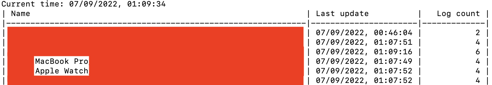

# FindMyHistory for Apple Devices

Apple's [FindMy app](https://apps.apple.com/us/app/find-my/id1514844621) only shows the current location and information of your Apple devices. Want to track your Apple devices and look up their past location, battery levels, and more? `FindMyHistory` can help you!

* **Supported devices:** `FindMyHistory` supports all types of Apple devices that you see in FindMy app, including AirTag, iPhone, iPad, MacBook, Apple Watch, AirPods, and more!

* **Supported information:** `FindMyHistory` tracks the location (longitude, latitude), the accuracy of the location, battery level, battery status (e.g., charging, charged), and more.

* **Privacy:** `FindMyHistory` only stores the history of your Apple devices in CSV files *locally* on your computer, without uploading them to any server. Therefore, you can easily look up the history of your Apple devices without worrying about leaking the information to other parties. 

* **Use cases:** 
	* **Locate your Apple devices in case they are lost or stolen:** In case your Apple device is turned off or runs out of battery, you will not be able to see the location of the device through FindMy. However, you can still find out the past locations of your devices through `FindMyHistory`. It is extremely useful when your device is lost or stolen. 
	* **Find and track anything you want:** Note that `FindMyHistory` supports AirTag. This means that you can use FindMyHistory to track the history location of everything you want. For example, you can put an AirTag in your car, and use `FindMyHistory` to record your car's trajectory. While there are many GPS Tracker products on the market, `FindMyHistory + AirTag` is much cheaper (GPS Trackers usually require a subscription fee), and more private (GPS Trackers store the location in their servers, while `FindMyHistory` only stores the location in your own computer).

## How to use it

The only thing you need is an Apple computer (e.g., MacBook (Air/Pro), iMac) with your Apple ID logged in and with Python3 installed. To use `FindMyHistory`, you only need to follow the three steps: 

* **Step 1:** [Grant file access permission to Terminal](https://osxdaily.com/2018/10/09/fix-operation-not-permitted-terminal-error-macos/) 
* **Step 2:** Open [FindMy app](https://apps.apple.com/us/app/find-my/id1514844621) and keep it active
* **Step 3:** Run `FindMyHistory` by opening Terminal and running

```
git clone https://github.com/fjxmlzn/FindMyHistory.git
cd FindMyHistory
pip3 install -r requirements.txt
python3 main.py
```

After that, `FindMyHistory` keeps logging the information of your Apple devices as long as FindMy app is active. 

In the Terminal, `FindMyHistory` shows the list of your Apple devices with their most recent update time, and the number of history records:


In `log` folder you can find all the history information of your devices. The logs of each day will be grouped in a subfolder. In the subfolders, you can find the logs in CSV files for each of your Apple devices, including locations, battery levels, and so on.


## Advanced functions

You can configure the refresh time, log folder, and many more in `FindMyHistory`. To look up all the options, you can run `python3 main.py --help`:

```
python3 main.py --help
usage: main.py [-h] [--refresh REFRESH] [--name_keys NAME_KEYS]
               [--store_keys STORE_KEYS] [--timestamp_key TIMESTAMP_KEY]
               [--log_folder LOG_FOLDER] [--no_date_folder]

Record Apple findmy history for Apple devices.

options:
  -h, --help            show this help message and exit
  --refresh REFRESH     Refresh interval (ms).
  --name_keys NAME_KEYS
                        Keys used to construct the filename for each device.
  --store_keys STORE_KEYS
                        Keys to log.
  --timestamp_key TIMESTAMP_KEY
                        The key of timestamp in findmy JSON
  --log_folder LOG_FOLDER
                        The path of log folder.
  --no_date_folder      By default, the logs of each day will be saved in a
                        separated folder. Use this option to turn it off.
```

## How it works

While FindMy is running, it stores the information of your devices in temporary files `~/Library/Caches/com.apple.findmy.fmipcore/Items.data` `~/Library/Caches/com.apple.findmy.fmipcore/Devices.data` in JSON format. `FindMyHistory` periodically reads these files and stores a new record for each device if there is an update. 

## Contributing

If you find bugs/problems or want to add more features to this library, feel free to submit issues or make pull requests.

